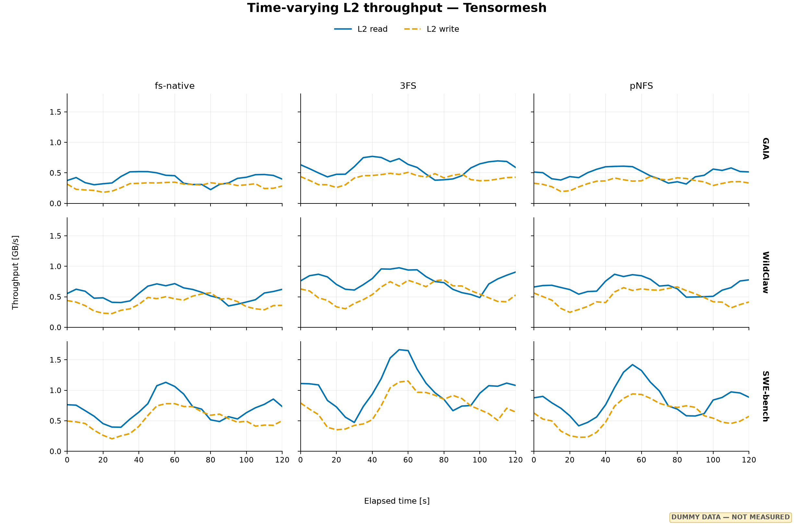
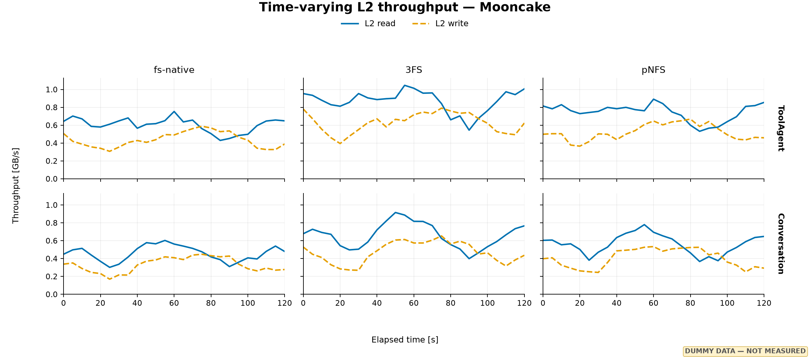
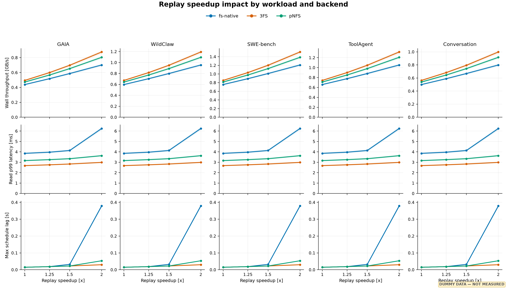
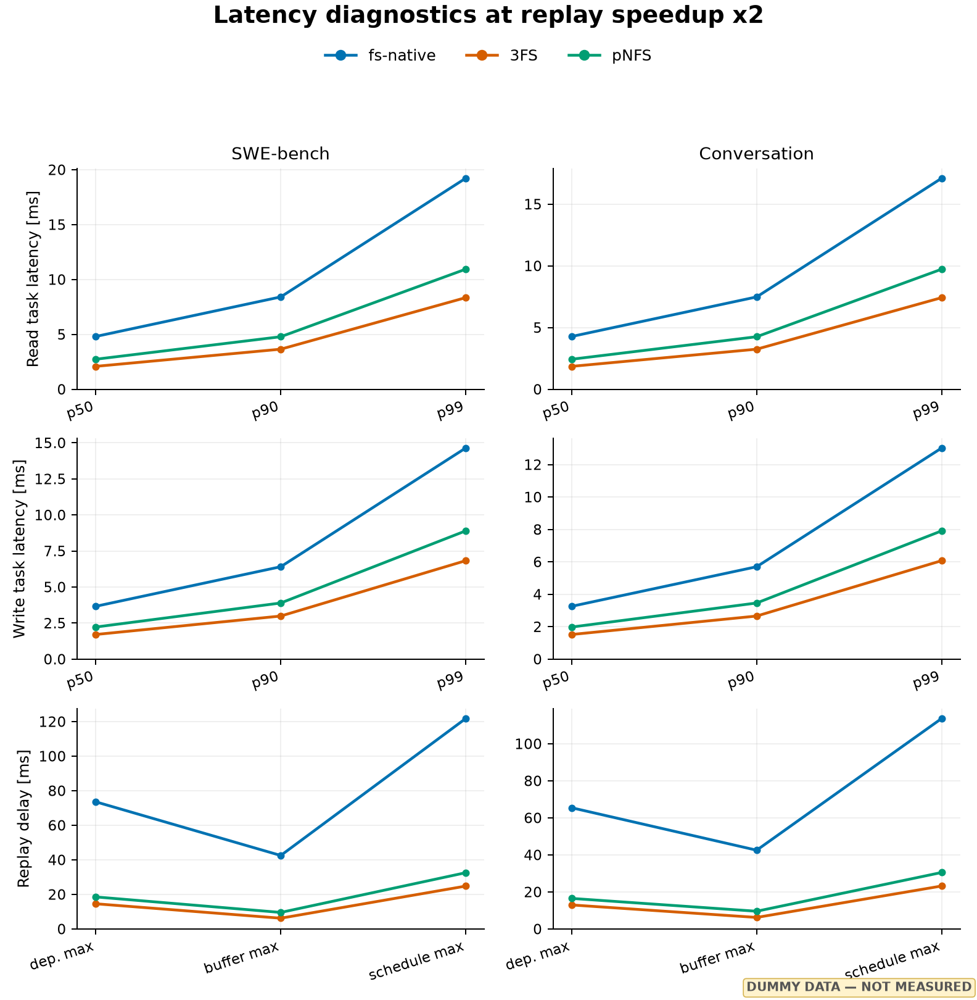
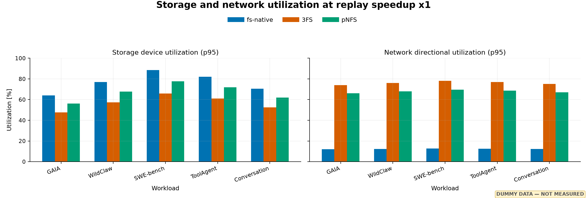
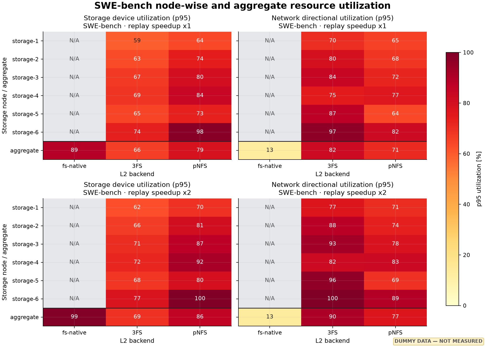
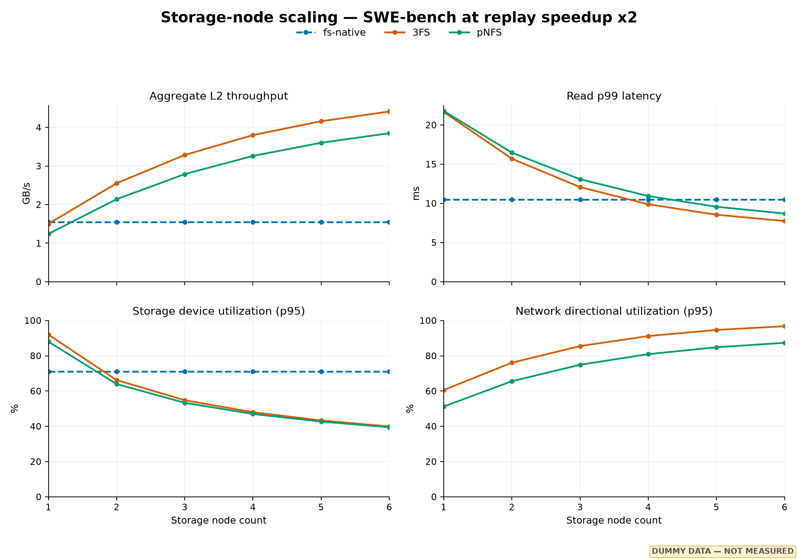

# LMCache L2 분산 스토리지 backend 성능 평가

> **초안 상태:** 아래 그림의 모든 값은 레이아웃 검토를 위한 더미 데이터다.
> 실측 결과로 교체하기 전에는 성능 비교나 결론의 근거로 사용할 수 없다.

| 항목 | 값 |
| --- | --- |
| 문서 버전 | Draft 0.1 |
| 실험 기간 | `[YYYY-MM-DD ~ YYYY-MM-DD]` |
| LMCache/Tracebench commit | `[commit SHA]` |
| 작성자 | `[이름]` |

## 1. 개요

### 1.1 평가 목적과 범위

동일한 L2 요청 trace를 인과 순서대로 재생하여 `fs-native`, `3FS`, `pNFS`의 throughput, latency, storage/network 병목과 storage-node 확장성을 비교한다.
평가는 L2 adapter와 자원 계측에 한정하며 application end-to-end 성능으로 일반화하지 않는다.

E1과 E2는 5개 workload, 3개 backend, speedup `x1`, `x1.25`, `x1.5`, `x2`를 비교한다.
`SWE-bench`(`tensormesh-swebench`), `mooncake-toolagent`, `mooncake-conversation`은 원본 trace가 너무 크므로 대표 subset으로 줄여 테스트한다.
축소 비율(`trace_percent`) 또는 고정 시간 구간, checksum, operation/byte 수를 기록하고 모든 backend와 speedup에 동일한 축소 trace를 사용한다.
E3~E5는 대표 workload를 사용하며, node scaling은 `SWE-bench` `x2`에서 `3FS`와 `pNFS`의 storage node 수 `1..6`을 비교한다.
각 case는 최소 3회, 핵심 case는 5회 반복한다. Speedup 근거는 3.3절에서 정의한다.

### 1.2 주장과 증거의 연결

| 주장 | 증거 |
| --- | --- |
| Workload/backend별 burst 처리 차이 | E1, 그림 1–2: interval throughput과 변동성 |
| Backend별 saturation knee | E2, 그림 3: throughput gain과 p99/lag |
| Tail latency의 지배 원인 | E3, 그림 4: task percentile과 replay delay |
| Storage/network 병목 | E4, 그림 5–6: throughput과 동시간대 utilization |
| Storage-node 확장성 | E5, 그림 7: throughput gain, p99, utilization, imbalance |

### 1.3 핵심 지표

| 범주 | 지표 |
| --- | --- |
| Throughput | 시간별 L2 read/write GB/s, x1 대비 gain |
| Latency/replay | Read/write p50·p90·p99, schedule/dependency/buffer delay |
| Resource/scale-out | Storage/network utilization p95, node별 imbalance, scaling efficiency |

반복 실험은 중앙값과 95% bootstrap confidence interval로 보고하며, 서로 다른 길이의 trace는 평균하지 않는다.

## 2. 배경 설명

### 2.1 LMCache Tracing

LMCache에는 `StorageManager` 수준의 trace record/replay 기능이 있다.
이 방식은 replay 과정에서 L1 reserve, lock, eviction, store, prefetch lifecycle을 다시 구성하므로, source와 target의 L1 상태나 정책이 다르면 실제 L2 I/O 요청 순서와 양도 달라질 수 있다.
따라서 동일한 L2 부하를 각 storage backend에 제공해야 하는 본 평가에는 그대로 사용하기 어렵다.

Tracebench는 이 제약을 피하기 위해 LMCache의 adapter-level L2 tracing으로 기록한 `l2.lct`를 사용한다.
Record 단계는 실제 L2 adapter task의 submission/completion, timestamp, key, object size와 outcome을 기록하고, replay 단계는 이를 하나의 target L2 adapter에 직접 제출한다.
Store→lookup과 lookup→load→unlock처럼 source 실행에 필요했던 causal dependency만 보존하며, 독립 task의 동시성과 submission 간격은 유지한다.
Replay speedup은 이 submission 간격만 축소하고 target adapter의 I/O latency는 변경하지 않는다.

L2 replay는 source의 L1 상태나 원본 KV payload를 복원하지 않는다.
Trace 시작 전부터 존재한 read object가 필요하면 같은 key와 byte size의 synthetic object를 측정 전에 준비하며, 준비 I/O는 결과에서 제외한다.
Source/target outcome 차이는 비교 metric으로 남기고, malformed trace, event drop, dependency 위반 또는 drain 실패는 유효하지 않은 replay로 처리한다.
Event 범위, dependency 규칙, object 준비와 유효성 contract의 상세 내용은 [L2 tracing guide](../docs/l2-tracing.md), 결과 지표는 [L2 replay metric guide](../docs/l2-replay-metrics.md)를 따른다.

### 2.2 L2 storage backend

본 보고서에서 비교하는 L2 storage backend는 local baseline과 distributed backend로 구분한다.
최종 실험 설정에는 **adapter + filesystem/storage + mount option**을 함께 기록한다.

| 보고서 표기 | 역할과 예정 구성 | 설정 상태 |
| --- | --- | --- |
| `fs-native` | LMCache `fs_native` adapter + replay host의 local storage + XFS filesystem. Distributed backend와 비교하기 위한 local baseline이다. | XFS 사용; device, mount option 등 TBD |
| `3FS` | NIXL/HF3FS adapter로 접근하는 3FS distributed filesystem backend. 여러 storage node에 데이터를 분산하는 구성을 비교한다. | adapter/version, storage node, striping/replication, mount 및 topology TBD |
| `pNFS` | `fs_native` 또는 NIXL `POSIX` adapter로 접근하는 pNFS distributed storage backend. parallel NFS data path와 metadata/data-server 구성을 비교한다. | adapter/version, NFS/mount option, node 및 topology TBD |

`fs-native`는 local storage baseline이므로 3FS·pNFS와 동일한 durability나 failure model을 제공한다고 해석하지 않는다.
3FS와 pNFS의 구체적인 adapter, 버전, storage node/device 수, replication·striping 정책, mount option, network topology는 실험 확정 후 TBD 값을 채운다.

### 2.3 Workload와 replay
TensorMesh의 `GAIA`와 `WildClaw`는 workload phase와 burst 차이를 비교하기 위한 trace로 사용한다.
`SWE-bench`는 상대적으로 높은 L2 pressure와 storage-node scale-out을 점검하는 대표 workload다.
Mooncake의 `ToolAgent`는 tool-interaction 패턴, `Conversation`은 conversational/interactive 패턴을 대표한다.
이 설명은 workload의 비교 목적을 나타내며, 실제 object size, read/write mix, request/operation 수는 각 trace metadata로 확정한다.

| Suite | Workload | Trace 표기 | 비고 |
| --- | --- | --- | --- |
| TensorMesh | GAIA | `tensormesh-gaia` | 실측 request/operation 수 기입 |
| TensorMesh | WildClaw | `tensormesh-wildclaw` | 실측 request/operation 수 기입 |
| TensorMesh | SWE-bench | `tensormesh-swebench` | 축소한 dataset percentage 명시 |
| Mooncake | ToolAgent | `mooncake-toolagent` | 축소한 timed trace 범위 명시 |
| Mooncake | Conversation | `mooncake-conversation` | 축소한 timed trace 범위 명시 |

동일 workload의 backend/speedup 비교에는 같은 `.lct` 파일과 축소 조건(`trace_percent` 또는 고정 시간 구간)을 사용한다.
Replay의 `--speedup s`는 source submission 간격을 `s`로 나눈 scaled-open replay다.
backend가 offered load를 따라가지 못하면 실제 submission window, schedule lag, drain time이 증가할 수 있으므로 throughput 하나만으로 speedup 효과를 판정하지 않는다.

## 3. 실험

### 3.1 실험 setup

아래 표들은 실험 전에 반드시 채운다.
특히 storage node 수와 network link rate가 없으면 cluster aggregate bandwidth와 network utilization을 재현할 수 없다.

#### Software

| 항목 | 설정값 |
| --- | --- |
| OS/kernel | `[예: Ubuntu 24.04 / kernel ...]` |
| LMCache/Tracebench | `[version, commit]` |
| NIXL/3FS/NFS client | `[version]` |

#### Replay host

| 항목 | 설정값 |
| --- | --- |
| CPU / memory / NUMA | `[값]` |
| NIC / link rate | `[예: 1 x 100 GbE]` |

#### Storage 및 filesystem

| 항목 | 설정값 |
| --- | --- |
| Storage node 수 / device 수 | `[값]` |
| Device model / capacity | `[값]` |
| Storage network topology | `[switch, link rate, bonding]` |
| Local filesystem / mount option | `XFS / [mount option TBD]` |
| pNFS mount option | `[값]` |

#### Replay 및 profiling

| 항목 | 설정값 |
| --- | --- |
| L1 size / worker 수 | `[값]` |
| Direct I/O / alignment | `[값]` |
| Profiling node roles | replay node + 모든 storage node |
| Profiling sample/report interval | `5 s / 5 s` |

#### Backend ceiling calibration (E0)

- Workload profile: 대표 trace인 `SWE-bench`와 `Conversation`의 object size와 read/write mix

Trace replay 결과를 해석하기 전에 각 backend의 effective ceiling을 같은 host와 network 경로에서 측정한다.
Trace에서 관측한 object size와 read/write 비율을 기준으로 direct-I/O sequential, random, mixed read/write microbenchmark를 수행하고 queue depth를 단계적으로 높인다.
결과에는 peak GB/s, IOPS, p99 latency, CPU, storage/network utilization을 기록한다.
이는 application 성능 주장이 아니라 다음 두 가지 sanity check에 사용한다.

- Replay throughput이 물리적으로 가능한 범위인지 확인한다.
- Resource utilization이 낮은데 throughput이 plateau일 때 adapter/metadata/CPU 병목을 구분할 기준선을 제공한다.

분산 backend의 replication과 durability 설정은 replay 실험과 같게 유지하며, local `fs-native` ceiling은 distributed backend의 동등 기능 비교값이 아니라 reference로만 사용한다.
Calibration 결과는 본문 setup 표에는 peak 값만 두고 전체 curve는 appendix로 보낸다.

논리적인 측정 경로는 다음과 같다.

```text
L2 trace -> replay host -> LMCache L2 adapter -> local FS / 3FS / pNFS
                    |                         |
                    |                         +-> storage node disk.tsv
                    +-> l2_replay_stats.json  +-> storage node network.tsv
                    +-> l2_io_interval.tsv
```

### 3.2 실험 A: 시간에 따른 L2 read/write throughput

**목적:** 시간별 throughput 변화를 확인하기 위해 workload burst와 read/write phase가 각 backend에서 어떻게 나타나는지 확인한다.

- Workload: 전체 5개
- 조건: replay speedup `x1`, 동일 trace, 동일 5초 interval
- 원본: case별 `l2_io_interval.tsv`
- x축: `elapsed_seconds`
- y축: `read_gb_per_second`, `write_gb_per_second` (decimal GB/s)
- 요약값: median/peak GB/s, p95 interval throughput, 변동계수

Markdown의 독립 이미지 여러 개를 subfigure처럼 배치하는 대신, 한 PNG 안에서 workload를 행, backend를 열로 둔 multiplot을 사용한다.
TensorMesh 3×3과 Mooncake 2×3으로 분리하여 panel 글자 크기를 유지한다.
각 row의 오른쪽 바깥에는 `GAIA`, `WildClaw`, `SWE-bench`, `ToolAgent`, `Conversation` workload 이름을 별도 row label로 표시하고, y축에는 공통 단위인 `Throughput [GB/s]`만 표시한다.
모든 panel에서 같은 y축 범위를 사용해야 backend 간 높이를 직접 비교할 수 있다.



**그림 1.** TensorMesh workload별 시간 구간 L2 throughput 구성 예시.
실선은 read, 점선은 write이며 값은 더미 데이터다.



**그림 2.** Mooncake workload별 시간 구간 L2 throughput 구성 예시.
값은 더미 데이터다.

실측 결과 서술 템플릿:

> `[workload]`는 `[구간]`에서 read/write burst가 나타났고, `[backend]`의 peak throughput은 `[값] GB/s`였다.
> 동일 구간의 다른 backend 대비 차이는 `[값]%`였으며, `[latency/schedule lag/resource]`의 동시 증가 여부로 `[병목 해석]`했다.

Adapter가 interval log를 제공하지 않아 `l2_io_interval.tsv`가 비어 있는 case는 node-level disk/network rate로 대체하지 않는다.
해당 L2 panel은 `N/A`로 남기고, 물리 자원 시계열은 실험 D에서 별도로 보고한다.

### 3.3 실험 B: Replay speedup 영향

**목적:** 같은 L2 trace를 더 빠르게 재생했을 때 throughput이 얼마나 늘고, 언제부터 queueing이 시작되는지 확인한다.

#### Speedup을 어떻게 해석하는가

Replay speedup s는 GPU를 s배 빠르게 만드는 옵션이 아니다.
기록된 submission 간격을 줄여 같은 L2 요청을 더 자주 보내는 옵션이다.

~~~text
submission_gap(s) = submission_gap(1) / s
offered_L2_rate(s) = s * offered_L2_rate(1)
~~~

따라서 x2는 같은 trace의 store/lookup 요청을 두 배 빠른 간격으로 발행한다는 뜻이다.
이 값은 GPU가 빨라져 L2 요청이 더 자주 발생하는 상황을 흉내 내지만, 실제 GPU의 end-to-end speedup을 보장하지는 않는다.
Batching, sequence length, cache policy가 달라지면 별도 실험으로 다룬다.

#### 권장 speedup 범위

이 보고서의 기본 speedup 범위는 **1.0 ≤ s ≤ 2.0**으로 고정한다.
두 서버 모두 8개 GPU를 사용하므로 GPU 개수 8을 speedup에 다시 곱하지 않는다.

| Speedup | 역할 |
| --- | --- |
| x1 | H100 trace 기준 부하 |
| x1.25 | 작은 부하 증가 |
| x1.5 | 현실적인 중간 지점 |
| x2 | 권장 범위의 상한 |

이 범위는 아래 제조사 공개 사양으로 H100 SXM 8-GPU와 B300 SXM 8-GPU 시스템을 대략 비교한 결과다.
서로 다른 precision이나 sparsity 조건을 섞지 않기 위해 두 시스템 모두 제조사가 표기한 FP8 system 성능을 사용한다.

| 8-GPU system 지표 | H100 × 8 | B300 × 8 | B300/H100 | 해석 |
| --- | ---: | ---: | ---: | --- |
| FP8 성능 | 32 PFLOPS | 72 PFLOPS | 2.25× | Compute-only 낙관적 상한 |
| GPU memory 용량 | 640 GB | 2,304 GB | 3.60× | Cache residency가 달라질 수 있어 L2 요청량 자체가 바뀔 수 있음 |
| GPU memory bandwidth | 26.8 TB/s | 최대 64 TB/s | 최대 2.39× | Memory-bound phase의 참고 상한 |
| GPU당 NVLink bandwidth | 900 GB/s | 1,800 GB/s | 2.00× | GPU 간 통신 상한이며 L2 storage throughput과는 별개 |

H100 수치는 [NVIDIA H100 제품 사양](https://www.nvidia.com/en-us/data-center/h100/)과
[DGX H100 datasheet](https://www.nvidia.com/content/dam/en-zz/Solutions/Data-Center/nvidia-dgx-h100-datasheet.pdf),
B300 수치는 [DGX B300 user guide](https://docs.nvidia.com/dgx/dgxb300-user-guide/introduction-to-dgxb300.html)와
[NVIDIA HGX AI Factory reference architecture](https://docs.nvidia.com/enterprise-reference-architectures/hgx-ai-factory/latest/components.html)를 기준으로 계산했다.
이는 peak theoretical specification 비교이며 실제 application benchmark 결과가 아니다.

FP8 system 성능 비율 `compute_rate_ratio = 72 / 32 = 2.25`를 사용하고,
H100 실행 시간 중 B300 compute 향상의 영향을 받는 비율을 `compute_fraction`으로 두면 다음과 같이 근사할 수 있다.

~~~text
effective_speedup =
    1 / ((1 - compute_fraction) + compute_fraction / compute_rate_ratio)
~~~

| Compute fraction 가정 | 근사 effective speedup |
| ---: | ---: |
| 0.5 | 1.38× |
| 0.7 | 1.64× |
| 0.8 | 1.80× |
| 1.0 | 2.25× |

따라서 x1.25, x1.5, x2는 비 compute 구간을 포함한 현실적인 부하 증가와 포화 여부를 먼저 확인하는 점들이다.
x2.25는 compute-only 이론 상한을 확인할 필요가 있을 때만 별도 stress point로 추가한다.
x2 또는 x2.25를 B300의 실제 end-to-end speedup이라고 주장하지 않는다.
특히 B300의 더 큰 HBM 때문에 실제 cache residency가 달라지면 동일 trace의 L2 요청 빈도를 단순 배율로 환산할 수 없다.
x2에서 actual submission window, pending, p99 latency가 급증하면 x2를 포화점으로 표시하고 더 높은 speedup은 기본 결과에서 제외한다.

#### 여러 B300 서버를 사용할 때

B300 producer 서버가 N_g대이면 이상적인 offered load는 N_g × effective_speedup이다.
하지만 실제 speedup은 shared L2와 network capacity 때문에 다음보다 클 수 없다.

~~~text
speedup(N_g) <= min(
    N_g * effective_speedup,
    L2_capacity / H100_trace_rate,
    network_capacity / H100_trace_rate
)
~~~

따라서 여러 서버의 결과는 먼저 N_g = 1, 2, 4로 측정하고, storage node 수는 별도 변수로 기록한다.
동일 trace를 여러 서버에서 복제하면 workload 확장이 아니라 의도적인 offered-load stress로 표시한다.

- Workload: 전체 5개
- 조건: speedup x1, x1.25, x1.5, x2; 나머지 설정 고정
- 주요 원본: sweep-summary.csv, case별 l2_replay_stats.json
- 주요 결과: wall throughput, read/write p99 latency, maximum schedule lag
- 추가 계산: throughput_gain(s) = wall_throughput(s) / wall_throughput(x1)
- 유효성 확인: target/actual submission window, pending, drain time

그림은 workload를 열로, 지표를 행으로 둔다.
Backend는 색으로 구분하고 반복 실험의 95% confidence interval을 band로 표시한다.
Throughput 증가와 함께 actual submission window, p99 latency, schedule lag을 확인하여 x2가 유효한 상한인지 판정한다.



**그림 3.** 권장 speedup x1, x1.25, x1.5, x2에서 workload/backend별 wall throughput, read p99 latency, maximum schedule lag을 비교하는 구성 예시.
값과 band는 더미 데이터다.

실측 결과 서술 템플릿:

> [backend]는 [workload]에서 x[값]까지 wall throughput이 증가했다.
> x[값]부터 p99 latency와 max schedule lag이 함께 증가하면 해당 지점을 포화점으로 판단한다.
> x1 대비 최대 유효 throughput gain은 [값]배였다.

Write p99도 같은 경향인지 함께 확인한다.
Read/write 중 하나만 악화된다면 aggregate wall throughput으로 이를 가리지 않고 operation별 결과를 설명한다.

### 3.4 실험 C: Latency breakdown과 queueing 진단

**목적:** latency 증가 원인을 확인하기 위해 tail latency 증가가 read/write adapter task 자체에서 발생하는지, replay가 dependency 또는 buffer를 기다리는 과정에서 발생하는지 구분한다.

- Workload: 대표 2개(`SWE-bench`, `Conversation`)
- 조건: `x1`과 각 backend의 saturation knee 직전·직후; 아래 더미 그림은 `x2` 예시
- Task 원본: `operations.read.<adapter>`와 `operations.write.<adapter>`의 p50/p90/p99
- Replay-delay 원본: max dependency wait, max buffer wait, max schedule lag
- 단위: task latency는 microseconds를 milliseconds로 변환하고 wait는 seconds를 milliseconds로 변환

위 두 종류는 같은 의미의 latency가 아니다.
Task latency는 adapter submission부터 completion까지이고, replay delay는 목표 제출 시각에 맞춰 task를 dispatch하지 못한 원인을 진단한다.
특히 `total_dependency_wait_seconds`와 `total_buffer_wait_seconds`는 operation별 합계이며 서로 겹칠 수 있으므로 wall-clock breakdown처럼 더하거나 stacked bar로 표시하지 않는다.
아래 그림도 이를 별도 행과 독립 축으로 표현한다.



**그림 4.** 대표 workload(`SWE-bench`, `Conversation`)의 `x2` read/write task percentile과 replay-delay diagnostic 구성 예시.
세 번째 행의 dependency, buffer, schedule 값은 비가산적이며 모든 값은 더미 데이터다.
최종 본문에는 `x1`과 saturation knee case를, 나머지 speedup은 appendix에 둔다.

실측 결과 서술 템플릿:

> `[workload/backend]`에서 `x[값]` 이후 `[read/write]` p99가 `[값] ms`로 증가했다.
> 같은 case에서 `[dependency/buffer/schedule]` delay가 `[값] ms`로 변해, 주된 원인을 `[adapter service/causal dependency/buffer 또는 dispatch queue]`로 판단한다.

현재 aggregate field만으로 완전히 additive한 latency breakdown을 만들 수는 없다.
이를 원한다면 operation별로 `t_target`, `t_dependency_ready`, `t_buffer_ready`, `t_submit`, `t_complete`를 같은 clock에서 수집해야 한다.
그때 다음처럼 분해하고, 각 component의 p50/p90/p99와 전체 `t_complete - t_target`을 함께 검증한다.

```text
dependency_wait = max(0, t_dependency_ready - t_target)
buffer_wait = max(0, t_buffer_ready - max(t_target, t_dependency_ready))
dispatch_wait = t_submit - max(t_target, t_dependency_ready, t_buffer_ready)
adapter_task_latency = t_complete - t_submit
target_to_completion = t_complete - t_target
```

### 3.5 실험 D: Storage/network utilization

**목적:** storage와 network 병목을 확인하기 위해 throughput plateau의 원인이 storage device인지 network인지 구분한다.

- Workload: 상세 분석은 대표 workload인 `SWE-bench`로 고정한다.
- 전체 workload aggregate는 그림 5의 overview로만 사용하고, node-wise hotspot 판정은 `SWE-bench` 결과로 수행한다.
- Storage 원본: 각 storage node의 `profile/<node>/disk.tsv`
- Network 원본: replay node와 각 storage node의 `profile/<node>/network.tsv`
- Storage 대표값: interval별 physical device 최대 `io_util_percent`의 측정 구간 p95
- Network 대표값: role별 directional utilization의 측정 구간 p95
- 보조값: disk read/write MiB/s, IOPS, network RX/TX MiB/s, error/drop

Network는 full-duplex이므로 RX와 TX를 더해 단일 link rate로 나누지 않는다.
같은 role의 node를 집계할 때 각 interval에서 다음 값을 사용한다.

```text
network_utilization =
    max(sum(rx_bytes_per_second), sum(tx_bytes_per_second))
    / sum(directional_link_bytes_per_second) * 100
```

Replay role과 storage role의 traffic은 같은 전송을 양쪽에서 센 값일 수 있으므로 서로 더하지 않고 별도로 보고한다.
Bond interface와 slave interface를 동시에 집계하지 않는다.
Storage utilization도 같은 physical I/O를 나타내는 partition과 parent device를 중복 합산하지 않는다.



**그림 5.** `x1`에서 workload/backend별 aggregate storage I/O utilization p95와 network directional utilization p95의 구성 예시.
값은 더미 데이터다.

Node aggregate만으로는 특정 storage node의 hotspot이나 load imbalance를 확인하기 어렵다.
그러나 모든 workload/backend 조합을 한 heatmap에 넣으면 node와 backend 비교가 복잡해지므로, 상세 분석은 `SWE-bench`를 고정하고 replay speedup `x1`과 `x2`를 비교한다.



**그림 6.** `SWE-bench`에서 replay speedup `x1`과 `x2`를 비교한 node-wise utilization heatmap 예시.
위 행은 `x1`, 아래 행은 `x2`이며, 왼쪽 열은 storage device utilization, 오른쪽 열은 network directional utilization이다.
각 panel의 열은 `fs-native`, `3FS`, `pNFS`이고, 행은 6개 storage node와 마지막 `aggregate`를 나타낸다.
`x1`은 기준 부하이고 `x2`는 throughput plateau 또는 자원 hotspot이 드러나는지를 확인하기 위한 비교점이다.
`fs-native`는 replay host의 local baseline이므로 6개 storage-node 행을 `N/A`로 표시하고,
`aggregate` 행에만 replay host의 local device 또는 replay-role network 값을 기록한다.
값은 더미 데이터이므로 실측 결과에서는 동일한 색상 범위와 node 순서를 유지해 backend 간 차이를 비교한다.

실측 결과에서는 storage와 network의 집계 방식이 다르므로 같은 색의 숫자라도 원본 metric 정의를 함께 기록한다.
분산 backend의 storage aggregate utilization은 node/device capacity를 가중치로 둔 평균으로 계산하고, network aggregate utilization은 모든 storage node의 실제 bytes/s를 합산한 뒤 전체 directional link capacity로 나눈다.
`fs-native` aggregate는 분산 backend와 합산하지 않고 replay host의 local device와 replay-role network에서 각각 계산한다.
Node-level storage 값은 node 내 physical device 중 최대 utilization을, node-level network 값은 해당 node interface의 directional utilization을 사용한다.

Node별 imbalance는 다음 지표로 요약한다.

```text
imbalance_max_mean = max(node_utilization) / mean(node_utilization)
imbalance_cv = std(node_utilization) / mean(node_utilization)
```

`imbalance_max_mean`이 1에 가깝고 `imbalance_cv`가 작으면 node 간 부하가 균등한 상태다.
특정 node의 값만 높으면 aggregate가 낮아도 hotspot으로 분류하고, 해당 node의 device·interface·metadata 경로를 추가로 확인한다.
6개 node가 아닌 환경에서는 heatmap의 node 행을 실제 node 수에 맞게 늘리거나 줄인다.
실측에서 `x2`가 포화 구간이 아니면 동일한 형식을 유지하되, 포화 직전 speedup을 추가 비교점으로 선택한다.

실측 결과 서술 템플릿:

> `[workload/backend/speedup]`에서 storage p95 utilization은 `[값]%`, network p95 directional utilization은 `[값]%`였다.
> Throughput plateau와 동시에 `[자원]`이 증가했고 `[다른 자원]`에는 headroom이 남아 있어, 주된 병목을 `[자원 또는 software path]`로 판단한다.

두 utilization이 모두 낮은데 latency와 schedule lag이 증가하면 adapter queue, metadata server, CPU/NUMA, lock contention, single-thread submission 경로를 추가로 확인한다.
`io_util_percent` 100%가 cluster 전체 포화와 동의어는 아니며, device 수와 queueing 구조를 함께 해석한다.

### 3.6 실험 E: Storage node 수에 따른 scale-out

**목적:** storage node 수에 따른 확장성을 확인하기 위해 storage node 수를 늘렸을 때 distributed backend의 aggregate throughput 확장성과 병목 변화를 확인한다.

- Workload: `SWE-bench` 하나로 고정한다.
- Backend: `3FS`, `pNFS`를 node-count scaling 대상으로 하고 `fs-native`는 local baseline으로 함께 기록한다.
- Replay 조건: speedup `x2`, 동일 trace, 동일 L1·worker·direct I/O 설정
- Storage node 수: `1, 2, 3, 4, 5, 6`
- 반복: `3FS`와 `pNFS`의 각 node 수 조합을 최소 3회, 핵심 `N=1`, `N=3`, `N=6`을 5회 반복한다. `fs-native` local baseline은 동일 trace를 3회 반복한다.

이 절의 N은 storage node 수 N_s를 뜻하며, 앞 절의 producer B300 서버 수 N_g와 다르다.
두 축을 동시에 바꾸는 실험은 N_g × N_s 2차원 sweep으로 별도 표기한다.
6개 node 환경에서 N_s개 case는 실제 storage node N_s개만 활성화한 구성으로 만든다.
단순히 replay client의 concurrency만 바꾸지 않으며, device 종류·capacity·network link rate·replication 정책은 가능한 한 동일하게 유지한다.
`N < 6`에서는 특정 node subset에 의한 편향을 피하기 위해 가능한 subset을 순환하거나 node assignment를 반복마다 바꾸고, 실제 활성 node 목록을 metadata에 남긴다.

`fs-native`는 replay host의 local/direct-attached storage이므로 storage node 수에 따라 확장되는 backend가 아니다.
따라서 그림에서 `fs-native`의 점선은 local baseline이며, distributed backend와 같은 scale-out 효율로 해석하지 않는다.

주요 결과는 다음 네 가지다.

- Aggregate L2 throughput과 `N=1` 대비 throughput gain
- Read p99 latency와 drain/schedule lag
- Storage device utilization p95
- Network directional utilization p95

Node 수에 따른 scaling은 다음 비율로 요약한다.

```text
throughput_gain(N) = throughput(N) / throughput(1)
scaling_efficiency(N) = throughput(N) / (N * throughput(1))
```

그림에서는 backend를 색으로 구분하고, `fs-native` local baseline은 점선으로 표시한다.
`3FS`와 `pNFS`의 throughput이 node 수에 따라 증가하다가 plateau에 도달하는지, latency와 utilization이 동시에 안정되는지를 함께 본다.
추가로 각 `N`에서 `imbalance_max_mean`과 `imbalance_cv`를 계산하여 특정 node에 부하가 몰리는지 확인한다.



**그림 7.** `SWE-bench`, replay speedup `x2`에서 storage node 수를 `1`개부터 `6`개까지 늘린 더미 결과.
왼쪽 위는 aggregate throughput, 오른쪽 위는 read p99 latency, 왼쪽 아래는 storage utilization, 오른쪽 아래는 network directional utilization이다.
`fs-native`는 node-count scaling 대상이 아니므로 점선 local baseline으로 표시했으며, 값은 모두 더미 데이터다.

실측 결과 서술 템플릿:

> `N=[값]`까지 `[backend]`의 aggregate throughput은 `[값] GB/s`로 증가했지만 `N=[값]` 이후 gain은 `[값]%`로 감소했다.
> 같은 구간의 read p99와 storage/network utilization을 함께 비교하여 scale-out의 한계를 `[network/storage/metadata/software path]`로 판단한다.

## 4. 결론

실측 후 결론은 다음 순서로 간결하게 작성한다.

1. **시간별 동작:** workload별 read/write phase와 burst 처리 차이를 요약한다.
2. **Scaling:** backend별 유효 speedup 범위와 saturation knee를 제시한다.
3. **Latency:** task tail과 replay delay 중 지배적인 증가 요인을 구분한다.
4. **병목:** storage/network/software path 중 관측 근거가 있는 병목을 제시한다.
5. **Scale-out:** storage node 수 증가에 따른 throughput gain, plateau, imbalance를 요약한다.
6. **운영 시사점:** workload 특성에 맞는 backend 선택과 안전한 offered-load 범위를 제안한다.

결론 템플릿:

> 동일 L2 trace replay에서 `[backend]`는 `[workload 또는 패턴]`에 가장 높은 `[지표]`를 보였고, `[backend]`는 `x[값]` 이후 `[latency/lag]` 증가로 scaling이 제한되었다.
> 자원 계측상 `[storage/network]`가 `[근거]`를 보여 주된 병목으로 판단했다.
> 다만 본 결과는 L2 adapter replay에 한정되며 application end-to-end 성능으로 일반화하지 않는다.

후속 실험으로는 L1 size sweep, replay instance 수 증가에 따른 aggregate contention, read/write 비율별 synthetic trace, warm-cache와 cold-cache 분리 평가를 고려한다.
이들은 현재의 5개 연구 질문에 대한 결론을 확정한 뒤 별도 섹션이나 후속 보고서로 분리한다.
